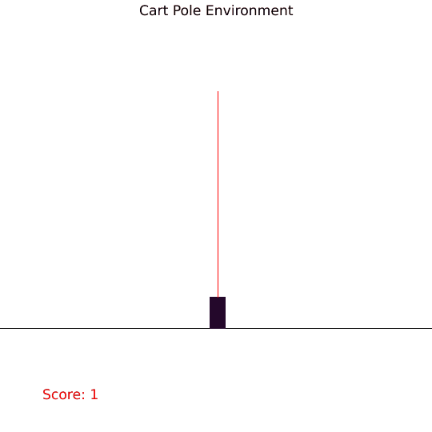
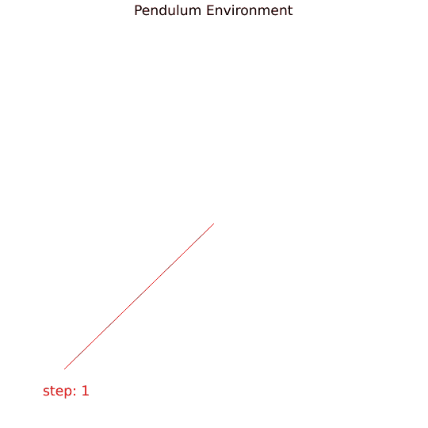

# OpenAI Gym written in pure Rust for blazingly fast performance :rocket:

This library aims be be as close to the original OpenAI Gym library which is written in Python
and translate it into Rust for blazingly fast performance.
This will make the use of Python unnecessary which is awesome.

If you don't mind Python and would like to use the original implementation from Rust,
 check out a gym [wrapper](https://github.com/MrRobb/gym-rs).

### Demonstration





### How to use
To use this crate in your project, put this in your Cargo.toml:

```toml
gym_rs = "0.2.1"
```

### Environments
- Cart Pole (discrete action)
- Mountain car (discrete action)
- Mountain car (continuous action)
- Pendulum (continuous action)

### Example
Check out [examples](examples/) folder, which shows how to solve cart_pole using [cosyne](https://github.com/MathisWellmann/cosyne)

Run examples it with:
```
RUST_LOG=info cargo run --example cart_pole --release --features="cosyne"
RUST_LOG=info cargo run --example pendulum --release --features="cosyne"
```

### TODOs:
- implement more environments
- compare performance to gym-rs python wrapper
- make generic implementation and compare f32 vs f64 performance.
- publish on crates.io
- introduce gif render style, so that black themed output is possible

### Contributions are welcome!
If you would like to add an environment or a feature, please fork this repository and create a pull request 
with your changes. Adding new environments should be as easy as translating from Python to Rust. See 
[OpenAI/gym](https://github.com/openai/gym)
for environments that are not yet implemented here! There is a lot of easy work to be done here.
Any Help is highly appreciated and benefits the Rust and ML/AI community greatly!

### Donations :moneybag: :money_with_wings:
I you would like to support the development of this crate, feel free to send over a donation:

Monero (XMR) address:
```plain
47xMvxNKsCKMt2owkDuN1Bci2KMiqGrAFCQFSLijWLs49ua67222Wu3LZryyopDVPYgYmAnYkSZSz9ZW2buaDwdyKTWGwwb
```


### License
gym-rs is licensed under MIT License just like OpenAI's Gym.

See [LICENSE.md](https://github.com/MathisWellmann/gym-rs/blob/master/LICENSE.md) for further details.
