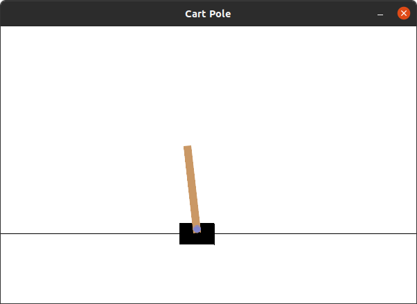
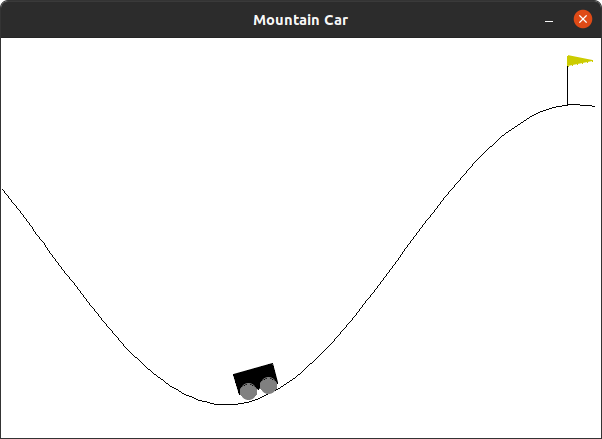

# OpenAI Gym (Unofficial Rust Implementation)

This library aims be be close to the original OpenAI Gym library written in Python.

If you don't mind Python and would like to use the original implementation from Rust,
check out a [OpenAI Gym wrapper](https://github.com/MrRobb/gym-rs).


## Prerequisites

This library use's SDL2 to enable various forms of rendering. Even when an SDL2
window is not explictly shown, renders can be saved to files making it a mandatory 
dependency if any form of rendering is to be done.

- [SDL2](https://wiki.libsdl.org/Installation)
- [SDL2_gfx](https://www.ferzkopp.net/Software/SDL2_gfx/Docs/html/index.html)

On Ubuntu you can install the dependency as such:
```shell
sudo apt-get install libsdl2-dev
```

On Arch:
```shell
sudo pacman -S sdl2 sdl2_gfx
```

If your using nix, you can get into the reproducible build environment as simple as:
```shell
nix-shell
```

## Usage

To use this crate in your project, put this in your Cargo.toml:

```toml
[dependencies]
gym_rs = "0.3.0"
```

## Examples

```bash
cargo run --example=cartpole
```


```bash
cargo run --example=mountain_car
```



## Contributions

Contributions are welcome. For the contribution guidelines, please take a look at [CONTRIBUTING.md](./CONTRIBUTING.md).

## Donations

If you would like to support the development of this crate, feel free to send over a donation:

Monero:

```plain
47xMvxNKsCKMt2owkDuN1Bci2KMiqGrAFCQFSLijWLs49ua67222Wu3LZryyopDVPYgYmAnYkSZSz9ZW2buaDwdyKTWGwwb
```


