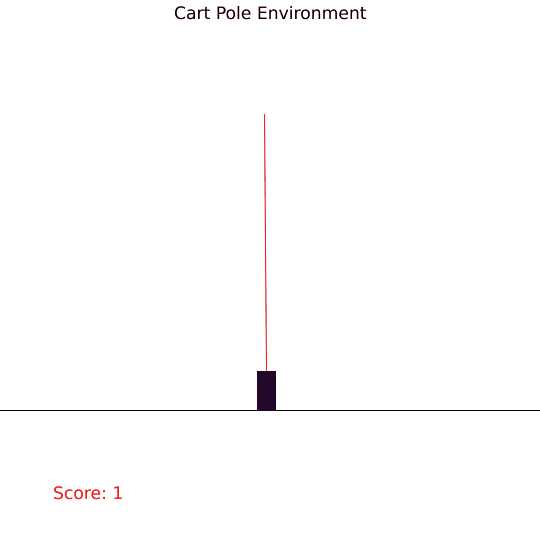
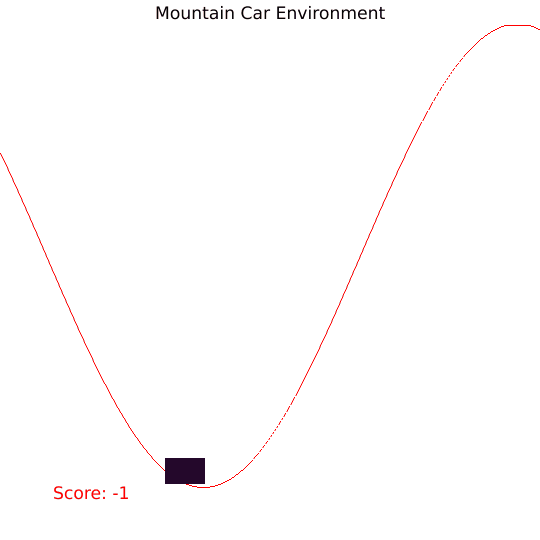
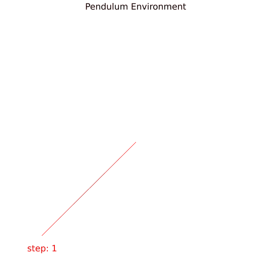

# OpenAI Gym written in pure Rust for blazingly fast performance :rocket:

:warning: :construction: Work in Progress :construction:

This library aims be be as close to the original OpenAI Gym library which is written in Python
and translate it into Rust for blazingly fast performance.
This will make the use of Python unnecessary which is awesome.

If you don't mind Python and would like to use the original implementation from Rust,
 check out a gym [wrapper](https://github.com/MrRobb/gym-rs).

### Demonstration






### How to use
To use this crate in your project, put this in your Cargo.toml:

```toml
gym_rs = { git = "https://www.github.com/MathisWellmann/gym-rs" }
```

### Environments
- Cart Pole (discrete action)
- Mountain car (discrete action)
- Mountain car (continuous action)
- Pendulum (continuous action)

### Example
Here is how you can use the cart_pole environment with a trained neural network agent from a file 
using the common genetic encoding ([cge](https://www.github.com/MathisWellmann/cge))  and rendering enabled:
```rust
/*
Cart Pole Environment solved using Neat
with a network in the form of a common genetic encoding (cge crate)
*/
extern crate cge;

use gym_rs::{ActionType, CartPoleEnv, GymEnv, GifRender};

fn main() {
    // load the network from file
    let mut net = cge::Network::load_from_file("./examples/gym_cart_pole_champion.cge").unwrap();

    let mut env = CartPoleEnv::default();

    let mut viewer = GifRender::new(
        540,
        540,
        "img/cart_pole_solved_render.gif",
            50
    ).unwrap();

    let mut state: Vec<f64> = env.reset();

    let mut end: bool = false;
    let mut total_reward: f64 = 0.0;
    while !end {
        if total_reward > 200.0 {
            println!("SOLVED!");
            break;
        }
        let output = net.evaluate(&state);
        let action: ActionType = if output[0] < 0.0 {
            ActionType::Discrete(0)
        } else {
            ActionType::Discrete(1)
        };
        let (s, reward, done, _info) = env.step(action);
        end = done;
        state = s;
        total_reward += reward;

        env.render(&mut viewer);
    }
    println!("total_reward: {}", total_reward);
}
```

Run it with:
```
cargo run --release --example cart_pole_solved_render --features="cge"
```

See [examples](https://github.com/MathisWellmann/gym-rs/tree/master/examples) folder for all the examples

### TODOs:
- implement more environments
- compare performance to gym-rs python wrapper
- make generic implementation and compare f32 vs f64 performance.
- publish on crates.io
- introduce gif render style, so that black themed output is possible

### Contributions are welcome!
If you would like to add an environment or a feature, please fork this repository and create a pull request 
with your changes. Adding new environments should be as easy as translating from Python to Rust. See 
[OpenAI/gym](https://github.com/openai/gym)
for environments that are not yet implemented here! There is a lot of easy work to be done here.
Any Help is highly appreciated and benefits the Rust and ML/AI community greatly!

### Donations :moneybag: :money_with_wings:
I you would like to support the development of this crate, feel free to send over a donation:

Monero (XMR) address:
```plain
47xMvxNKsCKMt2owkDuN1Bci2KMiqGrAFCQFSLijWLs49ua67222Wu3LZryyopDVPYgYmAnYkSZSz9ZW2buaDwdyKTWGwwb
```


### License
gym-rs is licensed under MIT License just like OpenAI's Gym.

See [LICENSE.md](https://github.com/MathisWellmann/gym-rs/blob/master/LICENSE.md) for further details.
